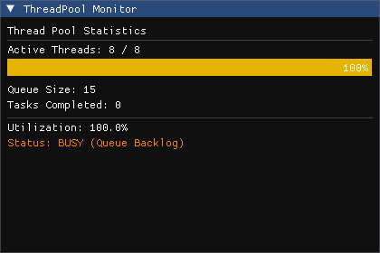

# Thread-Pool

[](LICENSE)
[](https://en.cppreference.com/w/cpp/20)

A C++ thread pool library with optional ImGui debugging support.

> **Note**: CI/CD workflow configuration is available in `docs/ci-cd/`. See the [CI/CD Setup Guide](docs/ci-cd/README.md) for instructions.

## Features

- Header-only thread pool implementation
- Thread-safe task queue
- Future-based task results
- Optional ImGui debugging window (build flag controlled)
- Real-time thread and queue statistics

## Basic Usage

```cpp
#include <thread_pool/thread_pool.h>

// Create a thread pool with 4 threads
multithreads::ThreadPool pool(4);

// Add a task
auto future = pool.addTask([]() {
    return 42;
});

// Get the result
int result = future.get();
```

## ImGui Debugging Window

The library includes an optional ImGui debugging window that displays real-time statistics about thread usage and task queue status.

### Demo



*The ThreadPool Monitor window displays real-time statistics: active threads (8/8), queue size (29), tasks completed, utilization (100%), and color-coded status indicator showing "BUSY (Queue Backlog)" when all threads are active with pending tasks.*

### Enabling ImGui Debug Support

To enable the ImGui debugging window, set the CMake option when configuring your project:

```bash
cmake -DTHREADPOOL_ENABLE_IMGUI_DEBUG=ON ..
```

### Using the Debug Window

When enabled, you can render the debug window in your ImGui render loop:

```cpp
#include <thread_pool/thread_pool.h>

multithreads::ThreadPool pool(8);

// In your ImGui render loop:
pool.renderDebugWindow("My ThreadPool Debug");
```

The debug window displays:
- **Active Threads**: Number of threads currently executing tasks vs total threads
- **Thread Utilization**: Visual progress bar and percentage
- **Queue Size**: Number of tasks waiting to be executed
- **Tasks Completed**: Cumulative count of completed tasks
- **Status Indicator**: Color-coded status (IDLE, ACTIVE, BUSY)

### ImGui Integration Requirements

When `THREADPOOL_ENABLE_IMGUI_DEBUG` is enabled, your project must:
1. Include ImGui in your project
2. Link ImGui to your executable
3. Set up an ImGui context and rendering backend

Example CMake setup for your project:

```cmake
# Your project CMakeLists.txt
add_subdirectory(Thread-Pool)
add_subdirectory(imgui) # or however you include ImGui

add_executable(MyApp main.cpp)
target_link_libraries(MyApp 
    PRIVATE 
    MultiThreadLib
    imgui)
```

### Without ImGui

When the debug flag is disabled (default), the library:
- Remains header-only
- Has minimal tracking overhead (atomic counters only)
- Does not require ImGui as a dependency
- The `renderDebugWindow()` method is not available

## Building

```bash
mkdir build
cd build

# Without ImGui debug (default)
cmake ..

# With ImGui debug
cmake -DTHREADPOOL_ENABLE_IMGUI_DEBUG=ON ..

cmake --build .
```

## Requirements

- C++20 or later
- CMake 3.10 or later
- ImGui (only when `THREADPOOL_ENABLE_IMGUI_DEBUG` is enabled)

## License

See LICENSE file for details.
